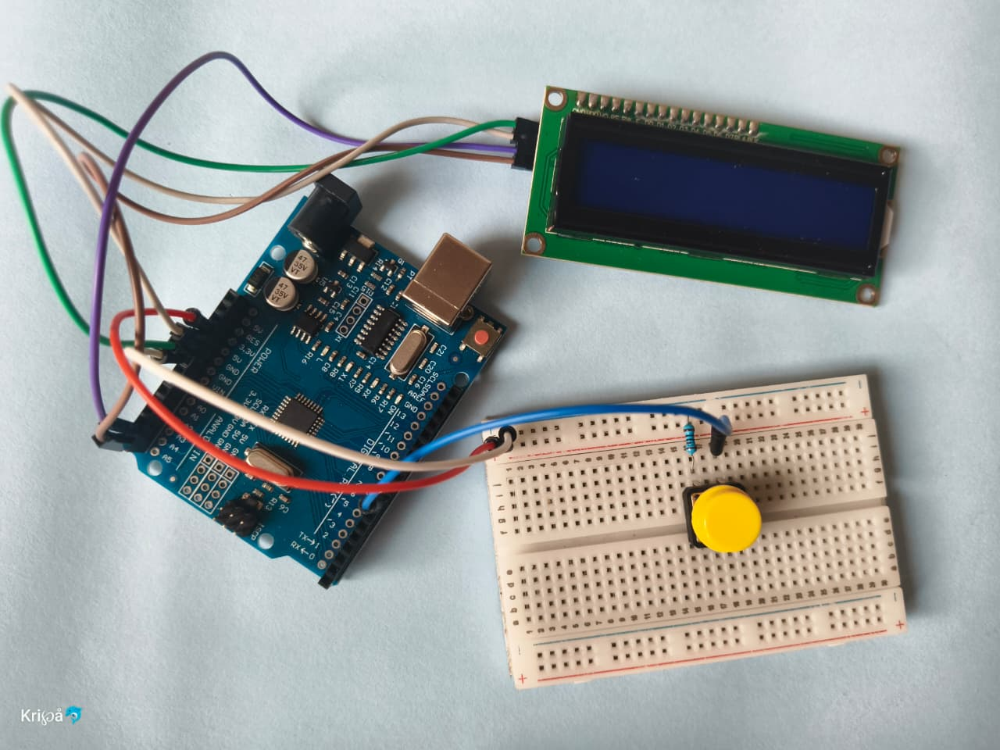

# LCD Runner Game 🎮

A simple Arduino LCD jumping game made using a 16x2 I2C LCD and push button.
In this game, the player jumps over obstacles and tries to achieve the highest score.

## Features

* 16x2 I2C LCD Display
* Push Button Jump Control
* Moving Obstacles
* Score Counter
* Game Over Screen
* Restart Game with Button

## Components Used

* Arduino UNO
* 16x2 I2C LCD
* Push Button
* Breadboard
* Jumper Wires

## Wiring

### I2C LCD Connections

| LCD Pin | Arduino UNO |
| ------- | ----------- |
| GND     | GND         |
| VCC     | 5V          |
| SDA     | A4          |
| SCL     | A5          |

### Push Button

| Button Pin | Arduino UNO |
| ---------- | ----------- |
| One Side   | D7          |
| Other Side | GND         |

## Libraries Required

* Wire.h
* LiquidCrystal_I2C.h

## How to Play

* Press the button to jump.
* Avoid the obstacles.
* Score increases when obstacle passes.
* Press button after Game Over to restart.

## Uploading Code

1. Open Arduino IDE
2. Install `LiquidCrystal_I2C` library
3. Select Arduino UNO board
4. Upload the code

## Project Preview

## Project Image

## Demo Video

  [Watch Demo Video](https://youtube.com/shorts/g5RwAaFt7a)

## Author

Made by Tsar Tech 🚀
